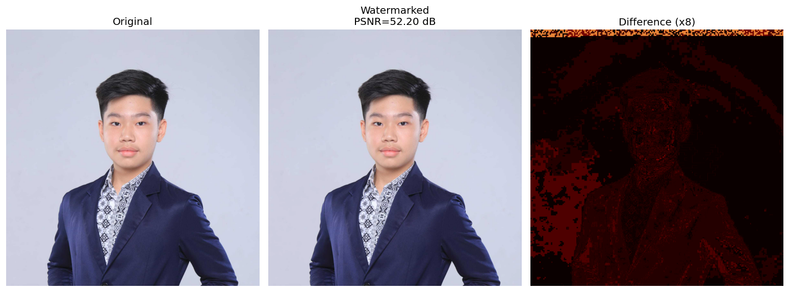

# JPEG Watermarking dengan DCT-QIM

Watermarking citra digital tak-kasat-mata (invisible) berbasis DCT (Discrete Cosine Transform) menggunakan teknik **Quantization Index Modulation (QIM)**. Proyek ini mengevaluasi seberapa kuat watermark bertahan terhadap kompresi JPEG pada berbagai tingkat kualitas (Quality Factor/QF).

  

> **Catatan:** Seluruh algoritma inti — mulai dari DCT, IDCT, konversi ruang warna, hingga simulasi kompresi JPEG — diimplementasikan **secara manual dari awal hanya menggunakan NumPy**. Tidak bergantung pada pustaka eksternal seperti `scipy.fftpack` atau fitur kompresi bawaan `PIL/OpenCV`.

## Demo

| Original | Watermarked | Difference (Map) |
|:---:|:---:|:---:|
|  |  |  |

*Watermark sepenuhnya tidak terlihat oleh mata manusia karena disembunyikan di dalam koefisien frekuensi DCT pada citra.*

## Cara Kerja (How It Works)

Gambar awal dikonversi dari ruang warna RGB ke **YCbCr**. Proses penyisipan (embedding) hanya dilakukan pada channel **Y (Luminance)** karena mata manusia paling sensitif terhadap perubahan intensitas cahaya (terang-gelap). 

Channel Y dibagi menjadi blok-blok berukuran **8×8 piksel** (unit standar yang digunakan pada kompresi JPEG). Sebuah watermark biner acak berukuran **32×32 piksel (1024 bit)** di-generate. Setiap bit disisipkan ke dalam satu blok 8×8 pada koefisien DCT di posisi **(4, 3)** (frekuensi menengah). 

**Aturan QIM (Quantization Index Modulation):**
Koefisien pada (4, 3) dikuantisasi dengan step `DELTA = 30`. 
* Jika bit yang disisipkan adalah `0` $\rightarrow$ nilai kuantisasi dibulatkan ke angka **genap**.
* Jika bit yang disisipkan adalah `1` $\rightarrow$ nilai kuantisasi dibulatkan ke angka **ganjil**.

Frekuensi menengah dipilih sebagai titik kompromi: frekuensi rendah akan merusak kualitas visual gambar, sedangkan frekuensi tinggi akan dengan mudah dihapus oleh algoritma kompresi JPEG. Setelah disisipkan, gambar diuji kekuatannya (*robustness*) dengan dikompresi menggunakan JPEG pada QF 95, 90, 80, 70, 60, 50, 40, 30, 20, dan 10. Tingkat kerusakan diukur menggunakan **BER (Bit Error Rate)** dan **NC (Normalized Correlation)**.

---

## Hasil per Langkah (Results)

Berikut adalah proses *step-by-step* dari sistem watermarking yang dijalankan:

**Step 1 — Load Citra & Pembagian Blok 8×8**
Gambar dimuat dan dimensinya di-*crop* ke kelipatan 8 piksel agar dapat dibagi habis menjadi blok-blok 8×8. Pada gambar ukuran 256×256, akan terbentuk 1024 blok (pas untuk menampung 1024 bit watermark).

**Step 2 — Konversi RGB ke YCbCr**
Gambar dipisah menjadi saluran warna Y, Cb, dan Cr. Watermark *hanya* akan memodifikasi matriks channel Y. Saluran warna Cb dan Cr dibiarkan utuh.

**Step 3 — Generate Watermark Biner**
Sistem membuat watermark berupa *noise* biner acak (0 dan 1) berukuran 32×32 piksel menggunakan *seed* tetap agar *reproducible*.
*(Tersimpan sebagai `output/watermark.png`)*

**Step 4 — Transformasi DCT dan Posisi Embedding**
Setiap blok 8×8 dari channel Y diubah ke domain frekuensi menggunakan matriks DCT orthogonal manual. Sistem menargetkan posisi koefisien menengah `(4, 3)` untuk meminimalisir degradasi visual.

**Step 5 — Proses Penyisipan QIM (`DELTA=30`)**
Bit watermark disisipkan dengan memanipulasi nilai genap/ganjil pada koefisien terpilih. Setelah di-IDCT kembali ke domain spasial dan digabung dengan CbCr, didapatkan gambar ber-watermark. 
* Kualitas visual tetap tinggi dengan rata-rata **PSNR > 40 dB** (sangat tidak kasat mata).
*(Tersimpan sebagai `output/comparison.png`)*

**Step 6 — Simulasi Kompresi JPEG & Ekstraksi**
Citra ber-watermark dikompresi secara sekuensial dari kualitas sangat baik (QF=95) hingga sangat buruk (QF=10). Watermark kemudian diekstrak ulang dari citra yang telah terkompresi. 
Semakin rendah QF, semakin besar matriks kuantisasi JPEG yang menggerus koefisien (4,3), sehingga paritas bit terbalik dan menyebabkan *error*.
*(Tersimpan sebagai `output/robustness.png`)*

**Step 7 — Evaluasi Ketahanan (BER & NC Curve)**
Hasil ekstraksi dievaluasi. Ekstraksi sempurna memiliki BER = 0. Jika BER melebihi batas batas ambang 0.25 (25% bit rusak), watermark dianggap **Gagal (FAILED)**.
*(Tersimpan sebagai `output/ber_curve.png`)*

---

## Ringkasan Ketahanan (BER Summary)

Berdasarkan pengujian, titik patah (*breakdown point*) ketahanan watermark ini berada pada nilai **Quality Factor (QF) = 60**. 

| QF | BER | NC | Status |
|:---:|:---:|:---:|:---|
| 95 | 0.0000 | 1.0000 | ✅ Extractable |
| 90 | 0.0000 | 1.0000 | ✅ Extractable |
| 80 | 0.0000 | 1.0000 | ✅ Extractable |
| 70 | 0.0000 | 1.0000 | ✅ Extractable |
| 60 | 0.2148 | 0.5703 | ⚠️ Degraded |
| 50 | 0.5107 | -0.0215 | ❌ FAIL |
| 40 | 0.5107 | -0.0215 | ❌ FAIL |
| 30 | 0.5596 | -0.1191 | ❌ FAIL |
| 20 | 0.5088 | -0.0176 | ❌ FAIL |
| 10 | 0.5107 | -0.0215 | ❌ FAIL |

**Kesimpulan:** Batas minimum aman untuk QF agar watermark masih dapat dikenali adalah **QF = 60**. Di bawah nilai tersebut (QF $\le$ 50), *Bit Error Rate* mencapai $\approx 0.5$, yang mengindikasikan watermark telah hancur sepenuhnya (setara dengan tebakan bit acak).

---

## Kebutuhan Sistem (Requirements)

Pastikan pustaka berikut sudah terinstal pada *environment* Python Anda:
```text
numpy>=1.24
matplotlib>=3.7
Pillow>=10.0